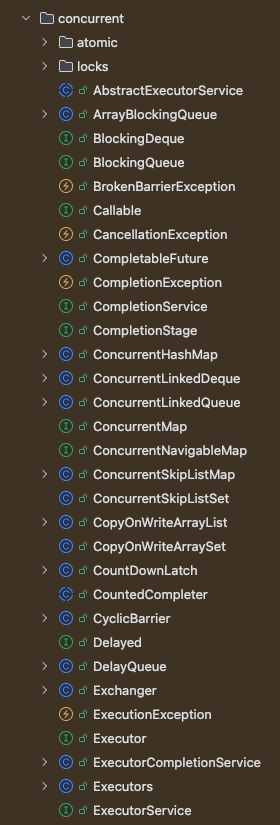

# 동시성 제어 방식에 대한 분석 및 보고서 작성

# Lock

## Lock 이란?

- Lock은 여러 스레드가 공유된 자원에 접근할 때 순서를 정해주어 데이터의 일관성을 유지하는 동기화 방법이다.

## 임계 구역 이란?

- 각 스레드들 이 공유하는 데이터를 변경하는 코드 영역

# 동시성 제어 방법

## synchronized

- synchronized 키워드를 사용하여 동기화를 제공한다.
- synchronized 키워드를 사용하면 해당 메소드나 블록을 한번에 하나의 스레드만 접근할 수 있도록 제한한다.
- 예시 ) ```java public synchronized void method() { ... }```
- 사용하는 경우
    - 멀티 스레드 환경에서 다른 스레드들의 접근을 막아야하는 경우 ( 한번에 하나의 실행 되어야 하는 경우 )
- 단점
    - 성능이 떨어진다.
    - 데드락이 발생할 수 있다.
    - 다른 스레드가 해당 메소드나 블록을 사용하지 못하게 되어 병목현상이 발생할 수 있다.

## volatile

- volatile 키워드를 사용하여 변수를 메인 메모리에 저장하고 캐시에 저장하지 않는다.
- volatile 키워드를 사용하면 변수를 읽고 쓸 때 CPU 캐시가 아닌 메인 메모리에서 직접 읽고 쓰게 된다.
- volatile 키워드를 사용하면 변수의 가시성을 보장한다.
- 예시 ) ```java private volatile boolean stop;```
- 사용하는 경우
    - 모든 스레드가 항상 최신의 값을 읽어야 하는 경우 ( 동일 시점에 동을 스레드가 같은 값을 보장 )
- 단점
    - 변수가 하나일 때만 사용할 수 있다.
    - 변수의 값을 읽고 쓰는 연산이 원자적이지 않다. = 단순히 최신 값만 보여짐

## Atomic

- java.util.concurrent.atomic 패키지에 있는 클래스들을 사용하여 원자적 연산을 제공한다.
    - java.util.concurrent.* 여기있는건 동시성 제어를 위한 클래스들이다.
- Atomic 클래스들은 내부적으로 CAS(Compare And Swap) 연산을 사용하여 원자적 연산을 제공한다.
- 예시 ) ```java private AtomicInteger atomicInteger = new AtomicInteger();```
- 사용하는 경우
    - 변수의 값을 읽고 쓰는 연산이 원자적이어야 하는 경우
- 단점
    - 변수가 하나일 때만 사용할 수 있다.
    - 변수의 값을 읽고 쓰는 연산이 원자적이지 않다.

# 동시성 문제 해결 방법 <과제>

- [공통 요구사항](요구사항%20정리.md)
    - 동일 유저에 대한 포인트 조회/충전/사용은 한번에 하나의 요청만 처리 가능
        - 다른 유저라면 동시에 처리 가능해야함 (유저별로 lock)

## 동일 유저에 대한 포인트 조회/충전/사용은 한번에 하나의 요청만 처리 가능

- synchronized 으로 구현(X) => 모든 유저가 대기해야함
- volatile 로 구현(X) => 동일 유저에 대한 요청이와도 동시에 처리
- Atomic 정의 만 보았 을 때 사용 가능 => concurrent 패키지를 찾아보자

### java.util.concurrent

- 

#### ReentrantLock

- ReentrantLock는 Lock 인터페이스의 구현체로 공정성, 비공정성 옵션(fair)을 가지고 있다.
- ReentrantLock은 lock(), unlock() 메소드를 사용하여 임계 영역을 설정한다.

### ReentrantReadWriteLock

- ReentrantReadWriteLock은 읽기와 쓰기를 분리하여 잠금을 설정한다.
- 읽기 잠금은 여러 스레드가 동시에 접근할 수 있지만 쓰기 잠금은 한번에 하나의 스레드만 접근할 수 있다.

### ReentrantLock 사용

- 근거 : ReentrantLock은 lock(), unlock() 메소드를 사용하여 임계 영역을 설정한다.
    - 임계 영역을 선택한다는건 우리가 원하는 범위에 동시성 제어가 가능,
- ReentrantLock 하나만으로 처리가 가능할까? NO.... 다른 유저라면 동시에 처리 가능해야 한다.

### 결론... ReentrantLock + ConcurrentHashMap

- ConcurrentHashMap을 사용하여 유저별로 lock을 걸어준다.
- `ConcurrentHashMap<Long, Lock> map = new ConcurrentHashMap<>();` 으로 선언
- `Lock lock = map.computeIfAbsent(id, k -> new ReentrantLock(true));` 을 이용해 lock을 생성하거나 가져온다.
- lock를 동시에 생성하고 동시에 lock을 걸어주면 어떻게될까? 라는 의문이 생겼다.
    - computeIfAbsent는 동시에 여러 스레드가 호출해도 한번반 실행을 보장하는 함수임으로 그럴리 없다고 되어 있다. ( 함수 설명 )
    - 오래걸리는 작업을 진행할 경우 뒤에 호출한 스레드는 블로킹 상태에 빠진다.

### 동시성 제어 테스트 도구

- ExecutorService : 스레드 풀을 생성하고 관리하는 클래스
- Executors.newFixedThreadPool(N); : N개의 스레드를 가지는 스레드 풀 생성 ( 한번에 실행될 스레드 풀 )
- CountDownLatch : 스레드가 종료될 때까지 대기하는 클래스
    - countDownLatch.await(); : countDownLatch의 count가 0이 될 때까지 대기한다.
        - 과제에서는 메인 스레드가 0이 될 떄까지 대기 하기 위해 사용
    - countDownLatch.countDown(); : countDownLatch의 count를 1 감소시킨다.

#### 동시성제어 테스트에서 바라던 점

- 포인트 충전/사용 시 예상된 기대값과 같은지 확인
- 동시성 제어가 잘 되는지 코드로 확인
- `ReentrantLock`의 공정성 옵션을 사용하였 을 때 호출 순서대로 실행되는지 확인

#### 테스트 결과

- 포인트 충전/사용 을 이용하여 동일하게 스레드를 이용하여 호출 했을 때 최종 포인트가 기대값과 같은 것을 확인 (O)
- 동시성 제어가 잘 되는지 코드로 확인 (X)
    - => 코드로 확인하기 어려움
- `ReentrantLock`의 공정성 옵션을 사용하였 을 때 호출 순서대로 실행되는지 확인 (X)
    - => History를 log로 찍어서 확인 하였으나 newFixedThreadPool을 이용한 호출이 비동기로 실행됨으로 순서대로 실행되지 않음
- 결론 : 동시성 제어는 잘 되는 것으로 보이나 코드로 확인하기 어려움

#### 우리가 진행한 동시성 제어에 대한 제한사항

- 단일 인스턴스 내에서 동작하는 제어방식
    - 실제 운영 환경에서는 여러 인스턴스가 동작하게 되므로 이를 고려하지 않았음

-------------------

### 참고

- [Thread 환경에서 동시성을 제어하는 방법](https://velog.io/@been/%EC%9E%90%EB%B0%94Multi-Thread%ED%99%98%EA%B2%BD%EC%97%90%EC%84%9C-%EB%8F%99%EC%8B%9C%EC%84%B1-%EC%A0%9C%EC%96%B4%EB%A5%BC-%ED%95%98%EB%8A%94-%EB%B0%A9%EB%B2%95)
- [Java의 concurrent 패키지](https://zion830.tistory.com/57)