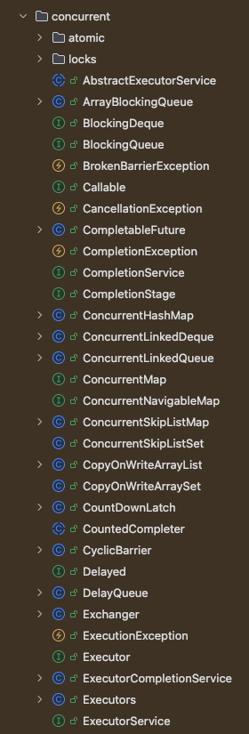

# 진행하면서 정리하기!

# 동시성 제어 문제 해결방법(JAVA)
 - synchronized
 - volatile
 - Atomic

## synchronized
 - synchronized 키워드를 사용하여 동기화를 제공한다.
 - synchronized 키워드를 사용하면 해당 메소드나 블록을 한번에 하나의 스레드만 접근할 수 있도록 제한한다.
 - 예시 ) ```java public synchronized void method() { ... }```
 - 사용하는 경우
   - 멀티 스레드 환경에서 다른 스레드들의 접근을 막아야하는 경우 ( 한번에 하나의 실행 되어야 하는 경우 )
 - 단점
   - 성능이 떨어진다.
   - 데드락이 발생할 수 있다.
   - 다른 스레드가 해당 메소드나 블록을 사용하지 못하게 되어 병목현상이 발생할 수 있다.

## volatile
 - volatile 키워드를 사용하여 변수를 메인 메모리에 저장하고 캐시에 저장하지 않는다.
 - volatile 키워드를 사용하면 변수를 읽고 쓸 때 CPU 캐시가 아닌 메인 메모리에서 직접 읽고 쓰게 된다.
 - volatile 키워드를 사용하면 변수의 가시성을 보장한다.
 - 예시 ) ```java private volatile boolean stop;```
 - 사용하는 경우
   - 모든 스레드가 항상 최신의 값을 읽어야 하는 경우 ( 동일 시점에 동을 스레드가 같은 값을 보장 )
 - 단점
   - 변수가 하나일 때만 사용할 수 있다.
   - 변수의 값을 읽고 쓰는 연산이 원자적이지 않다. = 단순히 최신 값만 보여짐

## Atomic
  - java.util.concurrent.atomic 패키지에 있는 클래스들을 사용하여 원자적 연산을 제공한다.
    - java.util.concurrent.* 여기있는건 동시성 제어를 위한 클래스들이다.
  - Atomic 클래스들은 내부적으로 CAS(Compare And Swap) 연산을 사용하여 원자적 연산을 제공한다.
  - 예시 ) ```java private AtomicInteger atomicInteger = new AtomicInteger();```
  - 사용하는 경우
    - 변수의 값을 읽고 쓰는 연산이 원자적이어야 하는 경우
  - 단점
    - 변수가 하나일 때만 사용할 수 있다.
    - 변수의 값을 읽고 쓰는 연산이 원자적이지 않다.

# 동시성 문제 해결 방법 <과제>
 - [공통 요구사항](요구사항%20정리.md)
   - 동일 유저에 대한 포인트 조회/충전/사용은 한번에 하나의 요청만 처리 가능
   
## 동일 유저에 대한 포인트 조회 
 - synchronized 으로 구현(X) => 모든 유저가 대기해야함
 - volatile 로 구현(X) => 동일 유저에 대한 요청이와도 동시에 처리
 - Atomic 정의 만 보았 을 때 사용 가능 => java.util.concurrent에 HashMap과 관련된 기능을 찾아보자

### java.util.concurrent
 -  
 - ConcurrentHashMap ( UserPoint 은 HashMap )
 - Lock
 - ReentrantLock

### 동시성 제어 테스트 도구
 - ExecutorService : 스레드 풀을 생성하고 관리하는 클래스
 - Executors.newFixedThreadPool(3); : 3개의 스레드를 가지는 스레드 풀 생성
 - CountDownLatch : 스레드가 종료될 때까지 대기하는 클래스
   - countDownLatch.countDown(); 호출 횟수 지정 